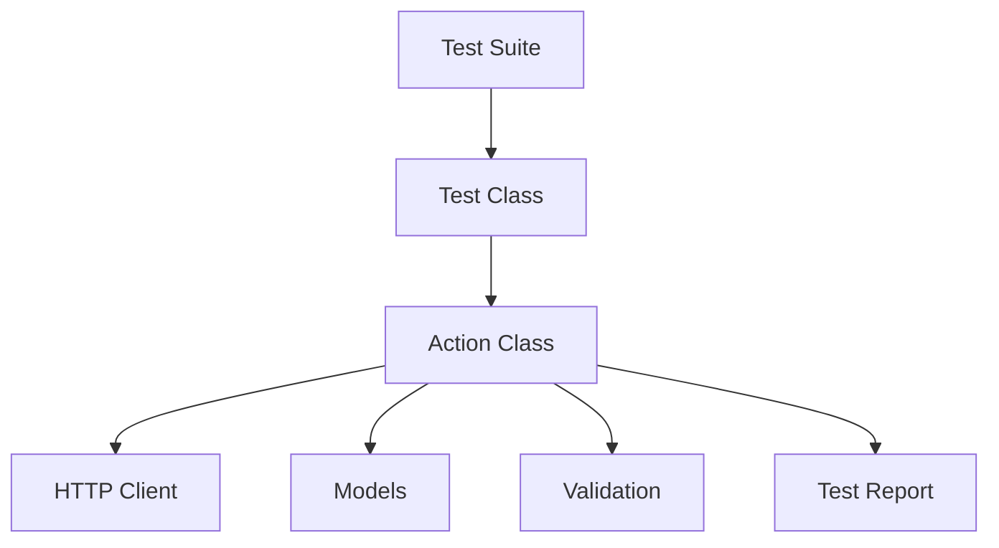

# **api_tests_kt**

Пример проекта автотестов на языке Kotlin
Инструменты: testNG, RestAssured, Allure

Запуск программы осуществляется командой maven = 

```
clean test -Dsurefire.suiteXmlFiles=data/suites/e2eTests.xml -Dconfig_name=data/stand_configs/demoqa.conf
```

Где 
  - surefire.suiteXmlFiles = путь до xml файла testNG
  - config_name = путь до файла конфигураций
  - 
---
Архитектура реализована в следующем виде: 

### Каталог 'data/'
📁 data/
├── 📂 resources
│ └── Общие настройки проекта: конфигурация логгера, настройки TestNG и т.д.
├── 📂 stand_configs
│ └── Конфигурационные файлы для разных тестовых стендов (DEV, QA, PROD)
└── 📂 suites
└── XML-сборки TestNG для группировки тестовых сценариев

### Каталог 'main/'
📁 **main/**  
├── 📂 **config**  
│   └── *Классы для работы с конфигурациями (парсинг YAML/JSON, управление окружениями)*  
├── 📂 **models**  
│   └── *DTO (Data Transfer Objects):*  
│       - Модели сущностей (User, Order, Product)  
│       - Модели запросов/ответов API  
├── 📂 **stores**  
│   └── *Классы-хранилища для данных (кеширование, shared state между тестами)*  
└── 📂 **utils**  
    └── *Вспомогательные утилиты: хелперы, кастомные исключения, утилитарные методы*

### Каталог `test/`
📁 test/
├── 📂 actions
│ └── Паттерн Page Object / Action: инкапсуляция бизнес-действий с валидацией
├── 📂 dataProviders
│ └── Источники данных для параметризованных тестов (CSV, Excel, JSON)
├── 📂 http
│ └── Клиенты для работы с HTTP (REST/SOAP, обработка запросов/ответов)
├── 📂 tests
│ └── Тестовые классы с @Test методами
├── 📂 validation
│ └── Кастомные валидаторы и Assertion-утилиты
└── 📂 utils
└── Специфичные для тестов утилиты: генераторы данных, тестовые хуки
---


