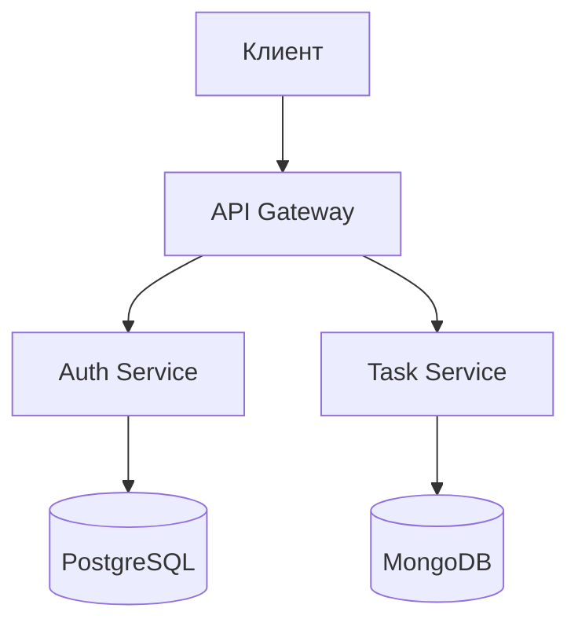

# **api_tests_kt**

Пример проекта автотестов на языке Kotlin
Инструменты: testNG, RestAssured, Allure

Запуск программы осуществляется командой maven = 

```
clean test -Dsurefire.suiteXmlFiles=data/suites/e2eTests.xml -Dconfig_name=data/stand_configs/demoqa.conf
```

Где 
  - surefire.suiteXmlFiles = путь до xml файла testNG
  - config_name = путь до файла конфигураций
  - 
---
Архитектура реализована в следующем виде: 

data/
| -- resources -> общие для проекта настройки: логгер, testNG и пр. 
| -- stand_configs -> место хранения конфигураций стендов 
| -- suites -> место хранения сьютов testNG 
main/ 
| -- config -> классы реализующие работу с конфигурациями стендов 
| -- models -> модели сущностей, запросов, ответов сервера 
| -- stores -> классы, реализующие хранение различных данных
| -- utils -> прочие инструменты 
test/ 
| -- actions -> классы-экшены. Один класс содержит одно действие и его валидацию. 
| -- dataProviders -> классы и файлы с данными для реализации параметризованных тестов 
| -- http -> классы для работы с http 
| -- tests -> непосредственно тесты 
| -- validation -> классы, реализующие валидацию резульататов тестов 
| -- utils -> прочие инструменты 
---


