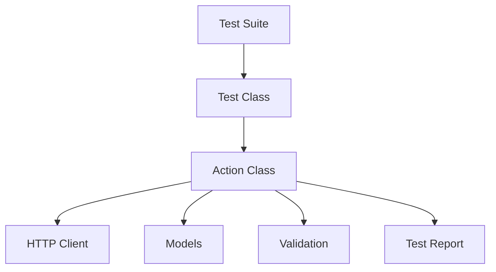

# **api_tests_kt**

Пример проекта автотестов на языке Kotlin

Инструменты: testNG, RestAssured, Allure

Запуск программы осуществляется командой maven = 

```
clean test -Dsurefire.suiteXmlFiles=data/suites/e2eTests.xml -Dconfig_name=data/stand_configs/demoqa.conf
```

Где 
  - surefire.suiteXmlFiles = путь до xml файла testNG
  - config_name = путь до файла конфигураций
---

```bash
.
├── data/
│   ├── resources/       # Общие настройки проекта
│   ├── stand_configs/   # Конфигурации тестовых стендов
│   └── suites/          # TestNG-сьюты
├── main/
│   ├── config/          # Работа с конфигурациями
│   ├── models/          # Модели данных
│   ├── stores/          # Хранилища состояния
│   └── utils/           # Вспомогательные утилиты
└── test/
    ├── actions/         # Бизнес-действия с валидацией
    ├── dataProviders/   # Параметризованные тесты
    ├── http/            # HTTP-клиенты
    ├── tests/           # Тестовые классы
    ├── validation/      # Кастомные проверки
    └── utils/           # Тестовые утилиты
```


